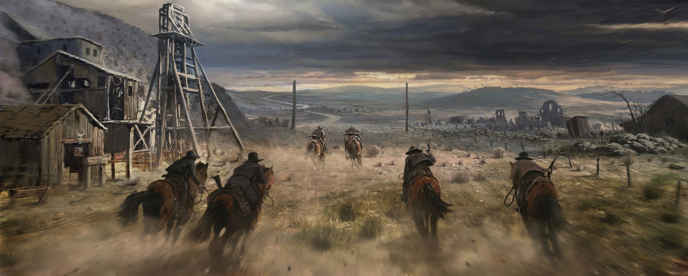

<!-- Western/Cowboy Theme - Layered Cowboys Image + Animated Wave -->

<!-- TIME_THEME_START -->

<<<<<<< HEAD

### *Draw fast, aim true*

☀️ Sun's blazin' overhead • 🌵 Peak heat • ⚡ High stakes
=======
### 🌅 SUNRISE (5am - 7am)

### *First light breaks, another day to ride*

🌄 Dawn's first glow • 🐓 Rooster's callin' • ⛺ Camp's stirrin' to life
>>>>>>> 2896a781a7000848c107d00cd0cb1a0c5587ace3

<!-- TIME_THEME_END -->

---

  

<!-- FOOTER_WAVE_START -->

<!-- FOOTER_WAVE_END -->

